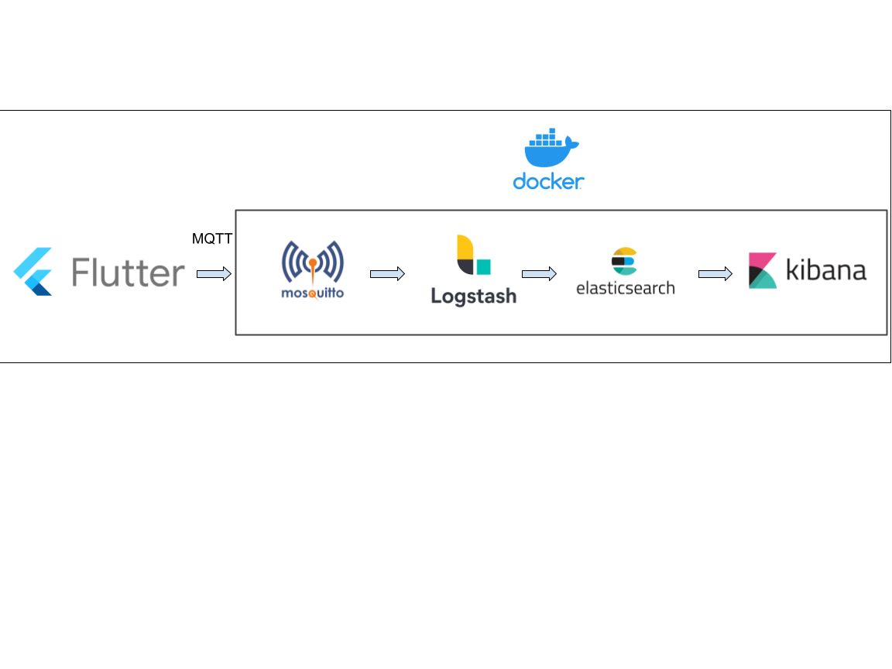

# Flutter + MQTT + ELK


##   Scenario

Imagine that you have a lot of apps, and want a place to analyze errors and metrics, this is possible using ELK with MQTT protocol.


## How it Works?



When some error or something that needs to be analyzed by metric occurs, it is sent using MQTT protocol to broker **Mosquitto**.

**Mosquitto** receives the message and makes it available to Logstash, who filters and parsers that message and saves the result in **Elasticsearch**.

**Kibana** consults **Elasticsearch** that way we can analyze logs and create dashboards for our metrics.


## Pré-Conditions

1. [Docker](https://docs.docker.com/get-docker/)
2. [Docker Compose](https://docs.docker.com/compose/)
3. [VS Code](https://code.visualstudio.com)
4. [Flutter](https://flutter.dev)
5. [Openssl](https://www.openssl.org)

## Configurating


### Certificates


#### Client

Certificate Authority, certificate of the CA that has signed the server certificate on the Mosquitto** **Broker


#### Broker (Mosquitto)


* Certificate Authority, certificate of the CA that has signed the server certificate on the Mosquitto Broker
* CA server certificate
* Server key for decryption

Exists a script that help us to create all certificates please check 

<span style="text-decoration:underline;">./credentials/create_credentials.sh</span>

After runned the script:


* Copy **server.crt**, **ca.crt**, **server.key** to <span style="text-decoration:underline;">./mosquitto/certs</span>
* Copy **ca.crt **to <span style="text-decoration:underline;">./flutter_example/assets</span>


#### Mosquitto + ELK

To run all system and began use it, at the root project folder run docker compose up command


* Kibana will be available at **5601** port
* Mosquitto will be available to messages at port **8883** and **1883**


### **Below there is some informations about how all this works, but you do not need horry about this because it is already configured** 


## How does it really work?


### Logstash

Logstash has no default MQTT communication so we install this plugin available 

<span style="text-decoration:underline;">./logstash/plugins/logstash-input-paho-mqtt-0.1.5.gem</span>

The install is realized by a script available at <span style="text-decoration:underline;">./logstash/Dockerfile</span>


```
 COPY plugins .
 
 RUN echo "-----Installing  logstash-input-paho-mqtt----"; \
 logstash-plugin install logstash-input-paho-mqtt-0.1.5.gem; \
 rm logstash-input-paho-mqtt-0.1.5.gem
```


	

How will Logstash receive data?

we can see how at <span style="text-decoration:underline;">./logstash/pipeline/logstash.conf</span>

Input is configured this way


```
 input {
     mqtt {
       client_id => "logstash"
       host => "mqtt"
       port => 1883
       topic => "mqtt"
     }  
 }
```


Host will communicate with **Mosquitto** by **1883** port and receive all date that we sends to **Mosquitto** 

Filters is configured to receive a json by message field 


<table>
  <tr>
   <td><code> filter { \
   json{ \
     source => "message" \
   }</code>
<p>
<code> filter { \
   json{ \
     source => "message" \
   } \
 }</code>
   </td>
  </tr>
  <tr>
   <td>
   </td>
  </tr>
</table>


So we can pass more data as json in this field, Logstash will filter and translate and merge with the data we sended 

All output will be sended to **Elasticsearch** to be available to **Kibana**


```
 output {
     elasticsearch {
     hosts => "elasticsearch:9200"
     user => "logstash_internal"
     password => "${LOGSTASH_INTERNAL_PASSWORD}"
   } 
 }
```


### Flutter

A example project is available at  <span style="text-decoration:underline;">./flutter_exemple/</span>


#### Using [flutter_logs](https://pub.dev/packages/flutter_logs) to send our logs

First pay attention if certificate is in correct folder with ca.crt name at  <span style="text-decoration:underline;">./flutter_exemple/assets/ca.crt</span>

At **pubspec.yaml** is added as dependencies flutter_logs


```
dependencies:
 flutter_logs: [LATEST_VERSION]
```


To assets and certificate be available to our app we must add it at pubspec


```
assets:
     - assets/
```


flutter_logs is initialized :


```
await FlutterLogs.initLogs(
     logLevelsEnabled: [
       LogLevel.INFO,
       LogLevel.WARNING,
       LogLevel.ERROR,
       LogLevel.SEVERE
     ],
     timeStampFormat: TimeStampFormat.TIME_FORMAT_READABLE,
     directoryStructure: DirectoryStructure.FOR_DATE,
     logTypesEnabled: ["device","network","errors"],
     logFileExtension: LogFileExtension.LOG,
     logsWriteDirectoryName: "MyLogs",
     logsExportDirectoryName: "MyLogs/Exported",
     debugFileOperations: true,
     isDebuggable: true);
```


To better work in Kibana we add metadata:


```
  await FlutterLogs.setMetaInfo(
     appId: "mqtt_example",
     appName: "Flutter MQTT Demo",
     appVersion: "1.0",
      language: "en-US",
     deviceId: "00012",
     environmentId: "1",
     environmentName: "dev",
     organizationId: "1",
     userId: "883023-2832-2323",
     userName: "tester",
     userEmail: "tester@gmail.com",
     deviceSerial: "YJBKKSNKDNK676",
     deviceBrand: "LG",
     deviceName: "LG-Y08",
     deviceManufacturer: "LG",
     deviceModel: "989892BBN",
     deviceSdkInt: "26",
      latitude: "0.0",
    longitude: "0.0",
     labels: "",
  );
```


** **

and add MQTT configuration to send our logs:


```
   await FlutterLogs.initMQTT(
       topic: "mqtt",
       brokerUrl: "192.168.18.8", //Add URL without schema
       port: "8883",
       certificate: "assets/ca.crt",
      writeLogsToLocalStorage: false);
```

## References
1. [flutter_logs | Flutter Package](https://pub.dev/packages/flutter_logs)
2. [Sending logs from Flutter apps in real-time using ELK stack & MQTT | by Umair Adil | ITNEXT](https://itnext.io/sending-logs-from-flutter-apps-in-real-time-using-elk-stack-mqtt-c24fa0cb9802)
3. [GitHub - deviantony/docker-elk: The Elastic stack (ELK) powered by Docker and Compose.](https://github.com/deviantony/docker-elk)
4. [GitHub - accelerando-consulting/iot-elk: Skeleton of an MQTT](https://github.com/accelerando-consulting/iot-elk)
5. [How to Configure SSL on the Mosquitto MQTT Broker](https://www.youtube.com/watch?v=f3f4h7q6x5g)
6. [Eclipse Mosquitto](https://mosquitto.org)
7. [Overview of Docker Compose](https://docs.docker.com/compose/)
8. [Get Docker](https://docs.docker.com/get-docker/)
9.  [Install Docker Compose](https://docs.docker.com/compose/install/)
10.  [OpenSSL](https://www.openssl.org)